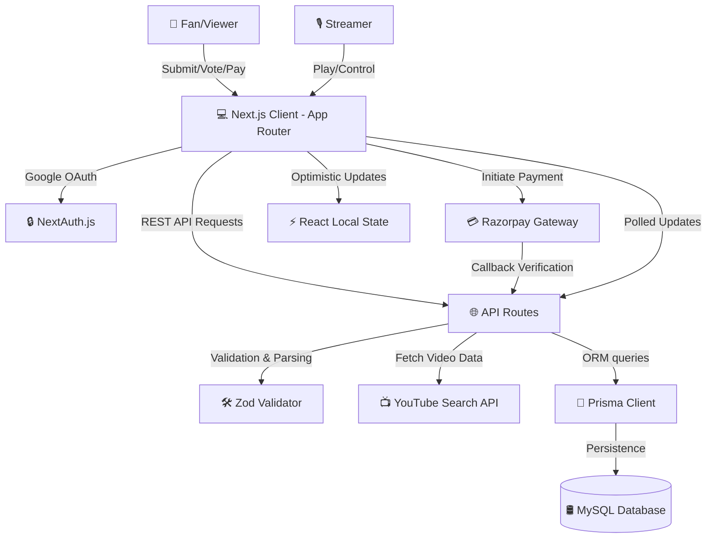

# 🎵 Votetunes

[](https://nextjs.org/)
[](https://react.dev/)
[](https://www.typescriptlang.org/)
[](https://www.prisma.io/)
[](https://tailwindcss.com/)
[](https://razorpay.com/)

**Votetunes** is a state-of-the-art collaborative stream queue manager designed for creators, streamers, and communities. It allows users to democratically curate music and video queues in real time through upvotes, downvotes, and prioritized paid requests.

---

## 📐 System Architecture

Votetunes is built with a highly responsive, modern full-stack architecture leveraging Next.js App Router and Prisma ORM.



### Key Architectural Concepts
- **Optimistic UI Updates**: Voting interactions instantly recalculate client-side order and reflect updates before the server confirmation returns, assuring a zero-latency feel.
- **Double Queue Engine**: The queue is split into a **Priority Queue** (Razorpay transaction verified) and a **Standard Queue** (sorted by net upvotes).
- **Prisma Schema Isolation**: Built-in support for multiple entities including `User`, `Stream` (video payload), `Payment`, `Upvote`, and `Space` (rooms).

---

## ⚡ Key Features

### 🌟 Present Features
* **Google Authentication**: Seamless user sign-in powered by NextAuth.
* **YouTube Stream Extraction**: Input YouTube URLs which are parsed, verified via Zod, and resolved using the YouTube API to fetch titles and thumbnails automatically.
* **Democratic Voting Engine**: Upvote or downvote queue items to dynamically update the playlist priority.
* **Paid Stream Prioritization**: Direct Razorpay integration allowing users to pay (e.g., ₹100 INR) to push a request directly to the streamer's Priority Queue.
* **Streamer Dashboard & Guest View**: Dedicated dashboard controls for creators to play, pause, skip, and manage streams, alongside guest views for viewers to submit and vote.
* **Automatic Queue Transition**: Seamless playback transitions that automatically pull the next stream when the current one finishes.
* **Premium Glassmorphism Design**: High-end UI with dark mode gradients, micro-interactions, responsive sidebars, and elegant toast notifications.

### 🚀 Future Roadmap (Under Development)
* **Real-time WebSockets / SSE**: Replace 5-second polling with instantaneous pub/sub updates for queue changes and votes.
* **Spotify Integration**: Full support for Spotify tracks, playlists, and playback controls.
* **Super Chat Overlays**: OBS-friendly transparent browser sources for streamers to project active streams and donation highlights directly on-screen.
* **Themed Spaces**: Customize queue permissions (e.g., max submissions per user, custom vote weighting, and customizable pay-to-play tiers).

---

## 🛠️ Tech Stack & Dependencies

- **Framework**: [Next.js 14 (App Router)](https://nextjs.org/)
- **Database ORM**: [Prisma Client](https://www.prisma.io/) + [MySQL](https://www.mysql.com/)
- **Authentication**: [NextAuth.js](https://next-auth.js.org/) (Google OAuth provider)
- **Payment Gateway**: [Razorpay SDK](https://razorpay.com/)
- **Validation**: [Zod](https://zod.dev/)
- **UI & Iconography**: [Tailwind CSS](https://tailwindcss.com/) + [Lucide React](https://lucide.dev/)
- **Embedded Player**: [React Lite YouTube Embed](https://github.com/ibrahimcesar/react-lite-youtube-embed) + [YT Player](https://github.com/feross/yt-player)

---

## 🚀 Getting Started

### 📋 Prerequisites
Ensure you have the following installed on your machine:
- **Node.js** (v18.x or later)
- **MySQL Database Server**
- **npm** or **yarn**

### 📦 Installation

1. **Clone the repository:**
   ```bash
   git clone <repository-url>
   cd project
   ```

2. **Install dependencies:**
   ```bash
   npm install
   ```

3. **Configure Environment Variables:**
   Create a `.env` file in the root directory (make sure not to commit it—it is ignored under `.gitignore`):
   ```env
   # Database connection
   DATABASE_URL="mysql://<username>:<password>@localhost:3306/<db_name>"

   # NextAuth details
   NEXTAUTH_SECRET="your-random-32-char-secret"
   NEXTAUTH_URL="http://localhost:3000"

   # Google Client Credentials (for Authentication)
   GOOGLE_CLIENT_ID="your-google-client-id"
   GOOGLE_CLIENT_SECRET="your-google-client-secret"

   # Razorpay Credentials
   RAZORPAY_KEY_ID="your-razorpay-key-id"
   RAZORPAY_KEY_SECRET="your-razorpay-key-secret"
   ```

4. **Initialize Database and Schema:**
   Deploy the Prisma migration to your MySQL instance:
   ```bash
   npx prisma db push
   ```

5. **Start Dev Server:**
   ```bash
   npm run dev
   ```
   Open [http://localhost:3000](http://localhost:3000) to view the application.

---

## 📂 Project Structure

```text
├── app/
│   ├── api/             # API handlers (auth, streams, payments, upvotes)
│   ├── components/      # Reusable UI components (Appbar, StreamView, Header, etc.)
│   ├── creator/         # Dynamic route for streamer page (/creator/[creatorId])
│   ├── dashboard/       # Streamer host dashboard
│   ├── lib/             # Database initialization (prisma client)
│   ├── utils/           # Helper scripts (Razorpay handlers, text parsing)
│   ├── globals.css      # Core tailwind setup and theme configs
│   └── page.tsx         # App home / landing page
├── prisma/
│   ├── schema.prisma    # MySQL Database schema definitions
│   └── migrations/      # Automated migration histories
└── public/              # Static assets, logos, and icons
```

---

## 🛡️ License

This project is licensed under the MIT License. Feel free to fork and customize!